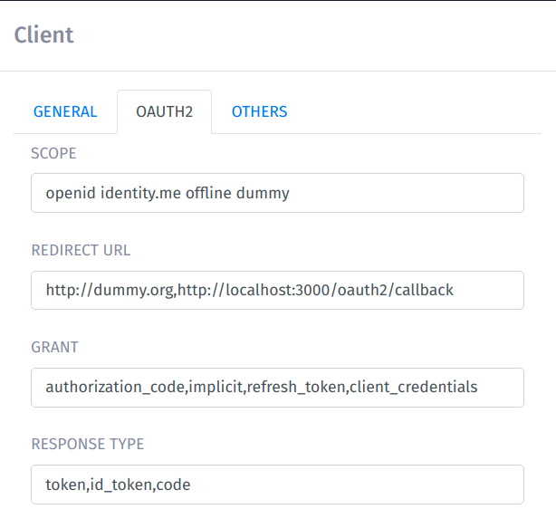

# NextID OAuth2 Client Demo App

Demo app for NextID training. After `git clone`:
```
npm install
node server.js {CLIENT_ID} {CLIENT_SECRET}
```

App runs on port 3000: `http://localhost:3000`.

`CLIENT_ID` and `CLIENT_SECRET` must be obtained from NextID management UI.

Also make sure that OAuth client configuration in NextID match the one in `ClientOAuth2` in server.js



https://github.com/ionelh/google-oauth-demo-app modified to use [client-oauth2](https://www.npmjs.com/package/client-oauth2) package